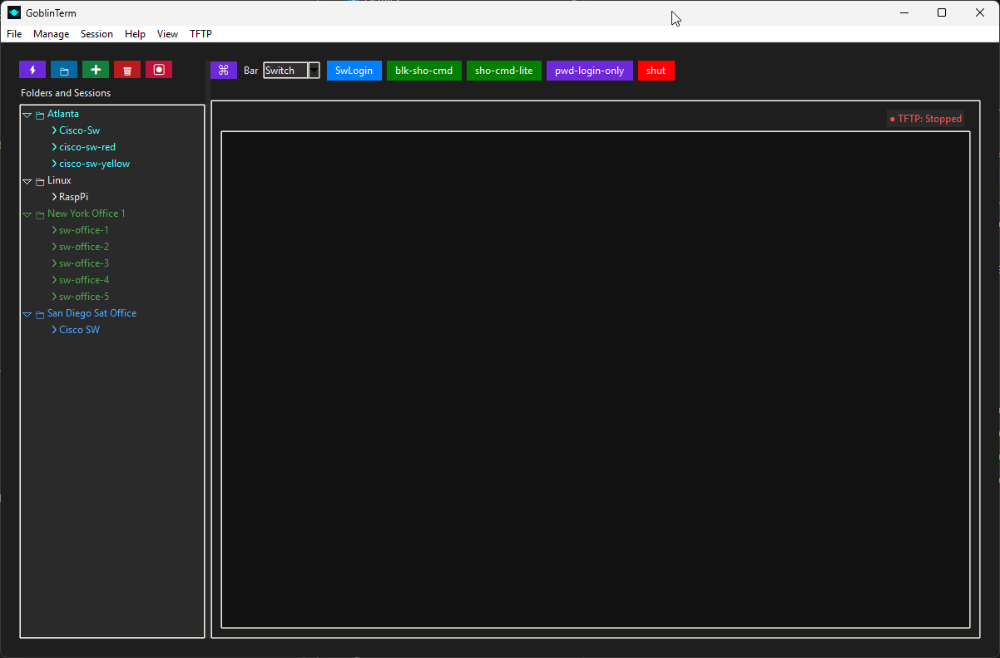
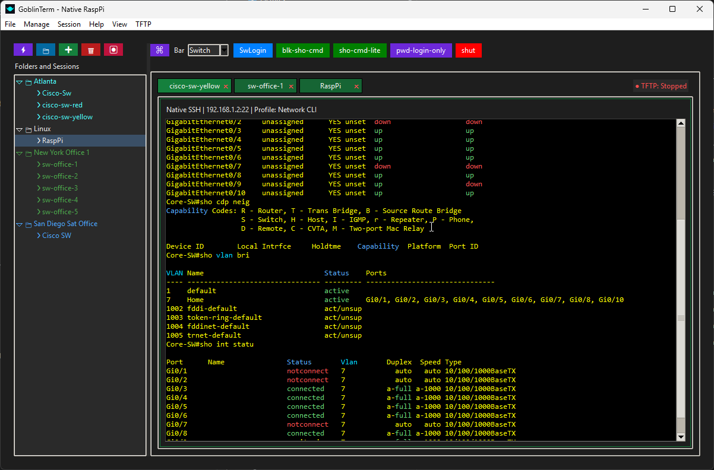
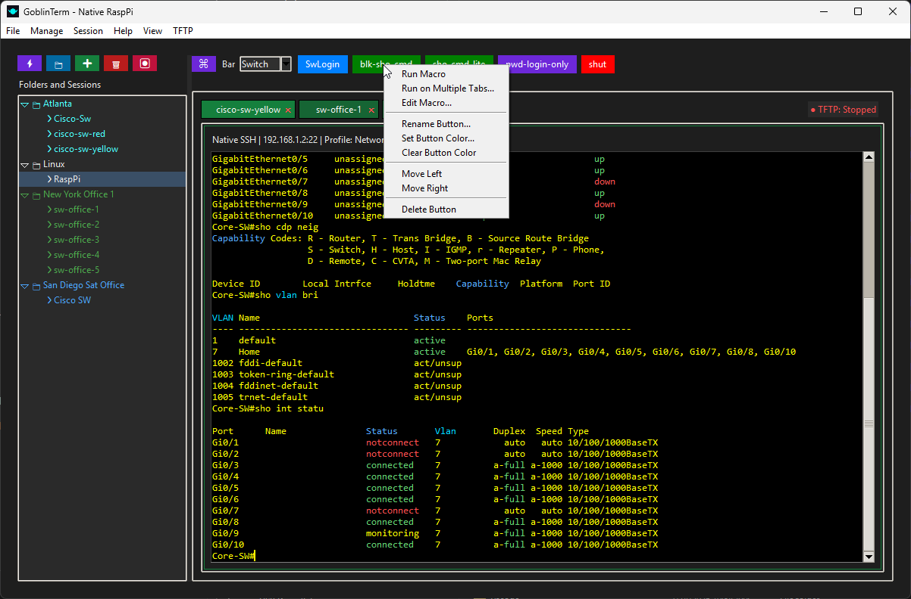

# GoblinTerm

GoblinTerm is a portable Windows terminal workspace for SSH, Telnet, and Serial connections.

It is designed for people who keep a library of infrastructure sessions and want a faster way to open tabs, organize connections, reuse commands, and move between network tasks without juggling separate terminal windows.

No Python install. No setup wizard. Download the latest release, extract it, and run `GoblinTerm.exe`.

---

## Latest Release

Download the current public build from [Releases](../../releases/latest).

Recommended files on each release page:

- `GoblinTerm-...-win64.zip`
- `GoblinTerm-...-SHA256.txt`

Quick start:

1. Download the latest ZIP from [Releases](../../releases/latest)
2. Extract it to a normal folder
3. Run `GoblinTerm.exe`

If you want detailed version-by-version changes, fixes, or upgrade notes, read the release notes attached to that release.

---

## At A Glance

---

## What GoblinTerm Does

GoblinTerm is built around persistent session management rather than one-off terminal launches.

It combines:

- a saved session library
- tabbed terminal workflows
- reusable macros
- quick multi-session actions
- portable Windows packaging

This makes it useful for homelab, network administration, infrastructure support, device access, and repeat terminal workflows.

---

## Core Capabilities

### Connection Types

- SSH sessions
- Telnet sessions
- Serial sessions

### Session Library

- Saved connection profiles with editable session settings
- Folder-based organization for large session collections
- Bulk-open actions for opening multiple saved sessions quickly
- Import, export, backup, and restore support

### Terminal Workflow

- Multi-tab terminal workspace
- Native terminal behavior tuned for interactive remote shells
- Per-tab connection lifecycle handling
- Portable packaged build for Windows

### Macros And Reusable Commands

- Saved command macros
- Toolbar-triggered macro execution
- Multi-tab macro execution for repeated operational tasks

### Operator Quality-Of-Life Features

- Saved credentials through the OS credential store
- Theme presets, including Cisco-friendly highlighting
- Settings intended for real terminal use rather than demo-only behavior

---

## Screenshots

### Multi-Tab Terminal Workflow

### Macro Actions And Multi-Session Operations

---

## Portable App Notes

- GoblinTerm is distributed as a portable Windows application
- Keep the extracted files together in the same folder
- User data is stored in your Windows profile, not beside the executable
- SHA256 checksum files are included with each release for verification

Windows may show a SmartScreen warning on first launch for unsigned builds. If that happens, use **More info** and then **Run anyway** only if you trust the release source.

---

## Support And Updates

- Download new builds from [Releases](../../releases/latest)
- Read per-release notes on the relevant release page
- Keep older builds only if you need them for rollback or comparison

---

## Support The Project

If GoblinTerm is useful to you and you want to help support continued work on it, you can do that here:

- [Buy Me a Coffee](https://buymeacoffee.com/pinggoblin)

---

## License

See [LICENSE](LICENSE) for release package licensing information.
